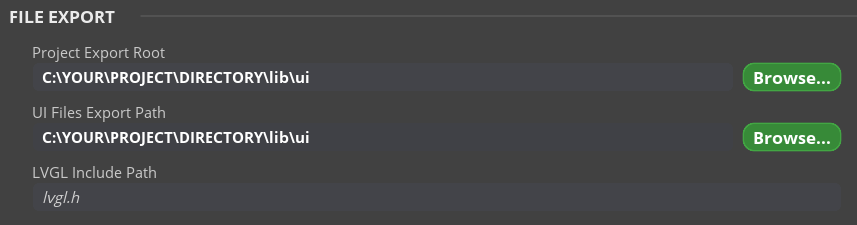

# Info

This branch is made to easily set up a project to be used alongside with [SquareLine_Studio](https://squareline.io/).

This project is made using reference by [Random Nerd Tutorials](https://randomnerdtutorials.com/lvgl-cheap-yellow-display-esp32-2432s028r/).

Libraries used in this project:
- [TFT_eSPI](https://github.com/Bodmer/TFT_eSPI)
- [XPT2046_Touchscreen](https://github.com/PaulStoffregen/XPT2046_Touchscreen)
- [LVDL](https://github.com/lvgl/lvgl)

# Setting up
Pull this repo and change the branch.

`git clone https://github.com/shah253kt/ESP32-2432S028R-PlatformIO`

`git checkout SquareLine_Studio`

In the `SquareLine_Studio`, click `File` > `Project Settings`. Under `FILE EXPORT` section, set the directory to the repository where you've pulled the branch at.

